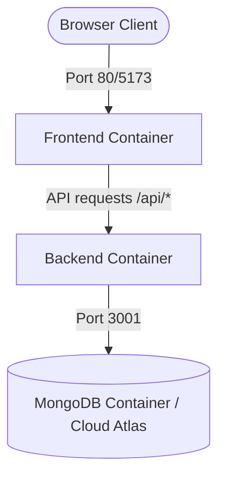

# Docker Containerization Plan for Markdown Viewer

This plan outlines the design and files needed to containerize both the frontend (React/Vite) and backend (Express/Node.js) components of the **Readme.md** Markdown Viewer application using Docker and Docker Compose.

---

## User Review Required

> [!NOTE]
> **Environment Variables**: Docker Compose will read configuration parameters directly from `.env` files. We will keep separate local configurations for development and cloud integrations.

> [!IMPORTANT]
> **Port Forwarding**: By default, the frontend will be accessible on `http://localhost:5173` (development) or `http://localhost:80` (production Nginx proxy), and the backend API will run on `http://localhost:3001`.

---

## Proposed Docker Architecture



### Component Breakdown

---

### [Component 1] Backend Container

#### [NEW] [Dockerfile](file:///home/pablo/Desktop/markdownfile_prj/backend/Dockerfile)
Create a Dockerfile to package the Node.js Express server.

* **Base Image**: `node:18-alpine` (lightweight and secure)
* **Build Steps**:
  1. Set working directory to `/usr/src/app`
  2. Copy `package.json` and `package-lock.json`
  3. Install dependencies (`npm ci` or `npm install --only=production`)
  4. Copy source files (excluding node_modules via `.dockerignore`)
  5. Expose port `3001`
  6. Define start command: `CMD ["node", "server.js"]`

---

### [Component 2] Frontend Container (Multi-Stage Build)

#### [NEW] [Dockerfile](file:///home/pablo/Desktop/markdownfile_prj/markdown-viewer/Dockerfile)
Create a multi-stage Dockerfile to build and serve the React application.

* **Stage 1: Build**
  * **Base Image**: `node:18-alpine`
  * **Steps**: Copy package files, install dependencies, copy source files, compile production build via `npm run build`.
* **Stage 2: Production Serve**
  * **Base Image**: `nginx:alpine`
  * **Steps**: Copy static assets from Stage 1's `dist/` folder to `/usr/share/nginx/html`.
  * **Nginx Configuration**: Custom `nginx.conf` file to support SPA routing (redirecting 404s back to `index.html`).
  * Expose port `80`

---

### [Component 3] Multi-Container Orchestration

#### [NEW] [docker-compose.yml](file:///home/pablo/Desktop/markdownfile_prj/docker-compose.yml)
Create a Docker Compose configuration at the root of the project to orchestrate all services.

```yaml
version: '3.8'

services:
  # Database Service (for offline local development)
  database:
    image: mongo:6.0
    container_name: markdown_mongodb
    ports:
      - "27017:27017"
    volumes:
      - mongo_data:/data/db
    networks:
      - markdown_network

  # Backend Proxy Server
  backend:
    build: ./backend
    container_name: markdown_backend
    ports:
      - "3001:3001"
    env_file:
      - ./backend/.env
    environment:
      - MONGO_URI=mongodb://database:27017/markdown_viewer  # Overrides to use internal DB service
    depends_on:
      - database
    networks:
      - markdown_network

  # Frontend Web Client
  frontend:
    build: ./markdown-viewer
    container_name: markdown_frontend
    ports:
      - "80:80"
    depends_on:
      - backend
    networks:
      - markdown_network

volumes:
  mongo_data:

networks:
  markdown_network:
    driver: bridge
```

---

### [Component 4] Development Configuration (Hot-Reloading)

#### [NEW] [docker-compose.dev.yml](file:///home/pablo/Desktop/markdownfile_prj/docker-compose.dev.yml)
An alternative compose file that enables mounting the host directory into the container to allow hot-reloading (nodemon / Vite HMR) during active code changes.

* **Backend**: Mounts `./backend:/usr/src/app` and runs `npm run dev` (nodemon).
* **Frontend**: Mounts `./markdown-viewer:/usr/src/app` and runs `npm run dev` (Vite dev server) forwarding port `5173`.

---

## Verification Plan

### Manual Verification
1. Run `docker compose -f docker-compose.dev.yml up --build` to verify development workflow with hot-reloading.
2. Run `docker compose up --build` to verify production multi-stage builds.
3. Access `http://localhost` to verify the frontend loads and connects to the backend proxy seamlessly.
