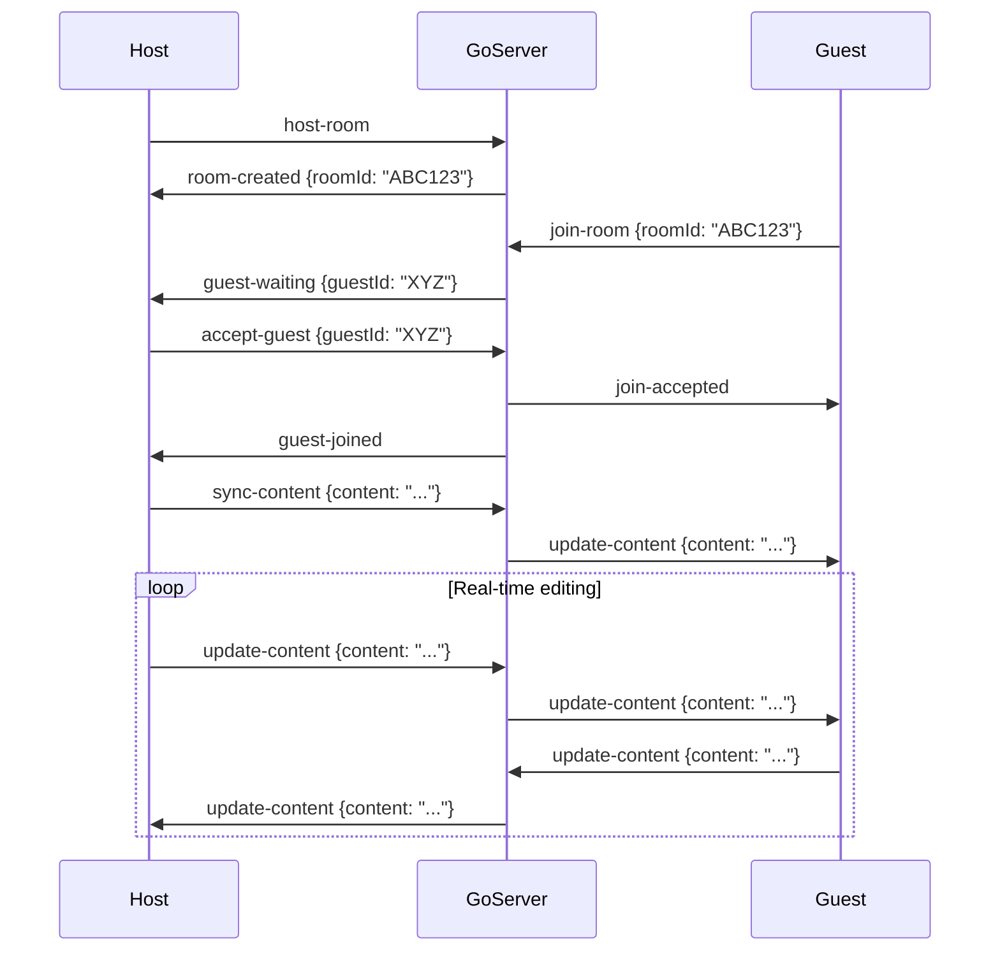

<p align="center">
  
  
  
  
  
  
</p>

# ✏️ Markdown Viewer

> A feature-rich, IDE-grade Markdown editor & viewer with real-time collaboration, cloud storage, AI assistant, and multi-format export — built with a modern React + Go + Node.js stack.

---

## 📑 Table of Contents

- [Overview](#overview)
- [Key Features](#key-features)
- [Architecture](#architecture)
- [Tech Stack](#tech-stack)
- [Project Structure](#project-structure)
- [Getting Started](#getting-started)
  - [Prerequisites](#prerequisites)
  - [Installation](#installation)
  - [Environment Variables](#environment-variables)
  - [Running Locally](#running-locally)
- [Deployment](#deployment)
- [Feature Deep-Dive](#feature-deep-dive)
- [Keyboard Shortcuts](#keyboard-shortcuts)
- [Themes](#themes)
- [API Reference](#api-reference)
- [WebSocket Protocol](#websocket-protocol)
- [Contributing](#contributing)
- [License](#license)

---

## Overview

**Markdown Viewer** is a professional-grade web application that brings the power of a full IDE to Markdown editing and previewing. Inspired by VS Code's layout and UX, it provides a complete writing environment with a file explorer, tabbed editing, live preview, document outline, workspace management, and more — all running in the browser.

What sets it apart:

- **Real-time collaboration** via a Go WebSocket server (Live Share)
- **Cloud file persistence** with Backblaze B2 object storage
- **AI-powered writing assistant** for summarization, grammar, translation, and diagram generation
- **Multi-format export** to PDF, HTML, DOCX, TXT, and AST JSON
- **Google OAuth + local auth** with JWT-secured API

---

## Key Features

### 🖥️ IDE-Grade Editor

| Feature | Description |
|---|---|
| **Monaco Editor** | Full VS Code editor with syntax highlighting, IntelliSense, and minimap |
| **Split View** | Side-by-side Markdown source + live preview with resizable panels |
| **Tabbed Editing** | Open multiple files in draggable, reorderable, pinnable tabs |
| **Breadcrumb Navigation** | Visual file path breadcrumbs above the editor |
| **Cursor Position** | Real-time line/column indicator in the status bar |
| **Auto-Save** | Debounced auto-save (1.5s) to local filesystem & cloud simultaneously |

### 📂 File System & Workspace Management

| Feature | Description |
|---|---|
| **Native File Access** | Import local folders via the File System Access API (`showDirectoryPicker`) |
| **File Explorer** | Recursive tree view with collapsible folders (excludes `node_modules`, `.git`) |
| **Context Menus** | Right-click on files/folders for Rename, Duplicate, Delete, Toggle Favorite |
| **Inline Creation** | Create new files and folders with inline inputs directly in the tree |
| **Workspaces** | Multiple named workspaces with independent folder handles, persisted in IndexedDB |
| **Workspace Settings** | Rename, add/remove folders, delete workspaces via a settings modal |
| **Favorite Files** | Pin frequently-used files to a Favorites section in the explorer |
| **Recent Files** | Quick access list of recently opened files on the welcome screen |

### ☁️ Cloud Storage (Backblaze B2)

| Feature | Description |
|---|---|
| **Cloud Save** | Every file save syncs to Backblaze B2 via the backend API |
| **Cloud Files** | Welcome screen shows your cloud-stored files for quick access |
| **Bulk Upload** | Upload all workspace files to cloud with one click |
| **Image Upload** | Drag & drop or paste images → presigned URL upload → auto-insert Markdown tag |
| **File Metadata** | MongoDB stores file metadata (name, size, timestamps, B2 key) per user |

### 🤝 Real-Time Collaboration (Live Share)

| Feature | Description |
|---|---|
| **Go WebSocket Server** | High-performance Go backend using Gorilla WebSocket |
| **Room-Based Sessions** | Host creates a room, shares a 6-char code, guests join by code |
| **Access Control** | Host must Accept or Reject each guest join request |
| **Document Sync** | Full document content is synced on join; incremental updates broadcast to all |
| **Auto-Reconnect** | WebSocket auto-reconnects with a 3-second backoff on disconnect |
| **Room Lifecycle** | Room closes and notifies all guests when host disconnects |

### 🤖 AI Assistant

| Feature | Description |
|---|---|
| **Chat Panel** | Dedicated sidebar chat UI with message history and quick suggestions |
| **Summarize** | Generate 5-point document summaries |
| **Explain** | Get plain-language explanations of selected text |
| **Improve Writing** | AI-powered writing refinement |
| **Fix Grammar** | Automated grammar and punctuation correction |
| **Translate** | Translate content to other languages |
| **Generate TOC** | Auto-generate a table of contents |
| **Mermaid Diagrams** | Generate flowchart/diagram code from descriptions |
| **Editor Integration** | Right-click selected text → AI actions directly in Monaco context menu |

### 📄 Rich Markdown Rendering

| Feature | Description |
|---|---|
| **GFM Support** | Tables, task lists, strikethrough, autolinks via `remark-gfm` |
| **Syntax Highlighting** | Code blocks with language-specific highlighting via Prism (`react-syntax-highlighter`) |
| **LaTeX/KaTeX** | Mathematical expressions via `remark-math` + `rehype-katex` |
| **Mermaid Diagrams** | Render flowcharts, sequence diagrams, etc. in fenced code blocks |
| **Emoji** | `:emoji_name:` shortcode support via `remark-emoji` |
| **Admonitions** | GitHub-style `[!NOTE]`, `[!TIP]`, `[!WARNING]`, `[!CAUTION]`, `[!IMPORTANT]` callouts |
| **HTML Support** | Raw HTML rendering via `rehype-raw` |
| **Auto Slugs** | Heading anchor IDs via `rehype-slug` for deep linking |
| **Sanitized Output** | DOMPurify integration for XSS protection |

### 📤 Multi-Format Export

| Format | Details |
|---|---|
| **PDF** | High-quality export via `html2pdf.js` with A4 layout |
| **HTML** | Standalone page with embedded styles |
| **DOCX** | Word document via `html-docx-js-typescript` |
| **TXT** | Raw plain text content |
| **JSON (AST)** | Markdown Abstract Syntax Tree via `unified` + `remark-parse` |

### 🔍 Search & Replace

| Feature | Description |
|---|---|
| **Workspace Search** | Search across all files in the workspace with debounced results |
| **Replace All** | Bulk find-and-replace across multiple files |
| **Match Options** | Case-sensitive, whole word, regex toggle buttons |
| **Result Preview** | Shows matching line numbers and snippets per file |

### 📋 Document Outline

| Feature | Description |
|---|---|
| **Heading Tree** | Hierarchical outline extracted from `#` headings |
| **Collapsible Sections** | Collapse/expand outline subsections |
| **Active Tracking** | Highlights the currently visible heading as you scroll the preview |
| **Click-to-Navigate** | Click an outline item to jump to that heading in both editor & preview |

### 🔐 Authentication

| Feature | Description |
|---|---|
| **Email/Password** | Local sign-up and sign-in with bcrypt password hashing |
| **Google OAuth 2.0** | One-click Google sign-in via `@react-oauth/google` |
| **JWT Tokens** | 24-hour expiry tokens stored in `localStorage` |
| **Auth Guard** | Protected API routes with Bearer token middleware |

### 🎨 Theming

5 built-in color themes, switchable from the status bar:

| Theme | Style |
|---|---|
| **GitHub Dark** | Default — dark background with blue accents |
| **GitHub Light** | Clean light theme matching GitHub's palette |
| **VS Code Dark+** | Classic VS Code dark scheme |
| **Dracula** | Purple-accented dark theme |
| **One Dark Pro** | Atom-inspired warm dark theme |

---

## Architecture

```
┌───────────────────────────────────────────────────────────────────┐
│                        Frontend (React/Vite)                      │
│  ┌──────────┐ ┌──────────┐ ┌──────────┐ ┌─────────┐ ┌─────────┐ │
│  │ Monaco   │ │ Preview  │ │ Explorer │ │ AI Chat │ │ Outline │ │
│  │ Editor   │ │ Pane     │ │ Sidebar  │ │ Panel   │ │ Panel   │ │
│  └──────────┘ └──────────┘ └──────────┘ └─────────┘ └─────────┘ │
│         │              │              │                           │
│         ▼              ▼              ▼                           │
│  ┌──────────────────────────────────────────────────────────────┐ │
│  │              Zustand Store + IndexedDB (idb-keyval)          │ │
│  └──────────────────────────────────────────────────────────────┘ │
└───────┬──────────────────────────────────────┬───────────────────┘
        │ REST API (JWT Auth)                   │ WebSocket
        ▼                                       ▼
┌────────────────────────┐         ┌────────────────────────┐
│  Node.js/Express API   │         │  Go WebSocket Server   │
│  ┌──────────────────┐  │         │  ┌──────────────────┐  │
│  │  Auth (JWT/bcrypt)│  │         │  │  Hub + Rooms     │  │
│  │  File CRUD       │  │         │  │  Guest Management│  │
│  │  Presigned URLs  │  │         │  │  Content Sync    │  │
│  └──────────────────┘  │         │  └──────────────────┘  │
│           │            │         │         Port 8080      │
│           ▼            │         └────────────────────────┘
│  ┌────────────────┐    │
│  │   MongoDB Atlas │    │
│  │  (Users, Files) │    │
│  └────────┬───────┘    │
│           ▼            │
│  ┌────────────────┐    │
│  │  Backblaze B2   │    │
│  │ (Object Storage)│    │
│  └────────────────┘    │
│       Port 3001        │
└────────────────────────┘
```

---

## Tech Stack

### Frontend
| Technology | Purpose |
|---|---|
| React 19 | UI framework |
| TypeScript 6 | Type-safe JavaScript |
| Vite 5 | Build tool & dev server |
| Monaco Editor | Code editor (VS Code engine) |
| React Markdown | Markdown → HTML rendering |
| remark/rehype plugins | GFM, math, emoji, raw HTML, slugs |
| Prism (react-syntax-highlighter) | Code block syntax highlighting |
| Mermaid | Diagram rendering |
| KaTeX | LaTeX math rendering |
| Framer Motion | Animations & transitions |
| Zustand | Lightweight state management |
| idb-keyval | IndexedDB persistence (workspaces) |
| Lucide React | Icon library |
| react-resizable-panels | Resizable split panes |
| html2pdf.js | PDF export |
| html-docx-js-typescript | DOCX export |
| file-saver | File download helper |
| @react-oauth/google | Google OAuth integration |

### Backend (Node.js)
| Technology | Purpose |
|---|---|
| Express 5 | REST API framework |
| Mongoose 9 | MongoDB ODM |
| bcrypt | Password hashing |
| jsonwebtoken | JWT generation & verification |
| @aws-sdk/client-s3 | Backblaze B2 (S3-compatible) uploads |
| @aws-sdk/s3-request-presigner | Presigned URLs for client-side uploads |
| cors | Cross-origin resource sharing |
| dotenv | Environment variable management |

### Collaboration (Go)
| Technology | Purpose |
|---|---|
| Go 1.20 | High-performance WebSocket server |
| gorilla/websocket | WebSocket library |

### Infrastructure
| Service | Purpose |
|---|---|
| MongoDB Atlas | User accounts & file metadata |
| Backblaze B2 | Object storage for Markdown files & images |
| Vercel | Deployment (frontend + backend) |

---

## Project Structure

```
markdownfile_prj/
├── .gitignore
│
├── markdown-viewer/                 # Frontend (React + Vite)
│   ├── index.html                   # Entry HTML
│   ├── package.json
│   ├── vite.config.ts
│   ├── tsconfig.json
│   ├── vercel.json                  # Vercel SPA routing
│   ├── .env                         # VITE_GOOGLE_CLIENT_ID
│   └── src/
│       ├── main.tsx                 # App entry with GoogleOAuthProvider
│       ├── App.tsx                  # Main application (2200+ lines)
│       ├── components/
│       │   ├── Auth.tsx             # Login/Signup page with Google OAuth
│       │   ├── ai/
│       │   │   ├── AskAI.tsx
│       │   │   ├── ChatPanel.tsx    # AI chat sidebar
│       │   │   ├── ExplainPopup.tsx
│       │   │   └── SummaryCard.tsx
│       │   ├── editor/
│       │   │   ├── Editor.tsx
│       │   │   ├── EditorTabs.tsx
│       │   │   ├── MarkdownEditor.tsx
│       │   │   ├── MiniMap.tsx
│       │   │   ├── MonacoEditor.tsx
│       │   │   └── SplitEditor.tsx
│       │   ├── explorer/
│       │   │   ├── ContextMenu.tsx
│       │   │   ├── FileItem.tsx
│       │   │   ├── FileTree.tsx
│       │   │   ├── FolderItem.tsx
│       │   │   ├── FolderTree.tsx
│       │   │   └── SearchPanel.tsx
│       │   ├── layout/
│       │   │   ├── ActivityBar.tsx
│       │   │   ├── Breadcrumb.tsx
│       │   │   ├── CommandPalette.tsx
│       │   │   ├── Explorer.tsx
│       │   │   ├── Layout.tsx
│       │   │   ├── Sidebar.tsx
│       │   │   ├── StatusBar.tsx
│       │   │   └── TitleBar.tsx
│       │   ├── preview/
│       │   │   ├── CodeBlock.tsx
│       │   │   ├── ImageViewer.tsx
│       │   │   ├── LinkPreview.tsx
│       │   │   ├── MarkdownPreview.tsx
│       │   │   ├── MathRenderer.tsx
│       │   │   ├── MermaidRenderer.tsx
│       │   │   └── TableRenderer.tsx
│       │   ├── outline/
│       │   │   ├── HeadingItem.tsx
│       │   │   └── OutlinePanel.tsx
│       │   ├── common/
│       │   │   ├── Button.tsx
│       │   │   ├── EmptyState.tsx
│       │   │   ├── Loader.tsx
│       │   │   ├── Modal.tsx
│       │   │   ├── SearchBar.tsx
│       │   │   └── Tooltip.tsx
│       │   ├── settings/
│       │   │   ├── Preferences.tsx
│       │   │   ├── ShortcutSettings.tsx
│       │   │   └── ThemeSelector.tsx
│       │   └── animations/
│       │       ├── Fade.tsx
│       │       ├── PageTransition.tsx
│       │       └── Slide.tsx
│       ├── services/
│       │   ├── ai.ts                # AI service (summarize, explain, etc.)
│       │   ├── aiService.ts
│       │   ├── exportService.ts
│       │   ├── fileService.ts
│       │   ├── markdownParser.ts
│       │   ├── searchService.ts
│       │   └── storageService.ts
│       ├── hooks/
│       │   ├── useCommandPalette.ts
│       │   ├── useExplorer.ts
│       │   ├── useKeyboard.ts
│       │   ├── useMarkdown.ts
│       │   ├── useSearch.ts
│       │   ├── useTabs.ts
│       │   └── useTheme.ts
│       ├── store/
│       │   ├── editorStore.ts
│       │   ├── fileStore.ts
│       │   ├── searchStore.ts
│       │   ├── settingsStore.ts
│       │   ├── tabStore.ts
│       │   └── themeStore.ts
│       ├── context/
│       │   ├── CommandContext.tsx
│       │   ├── FileContext.tsx
│       │   └── ThemeContext.tsx
│       ├── styles/
│       │   ├── globals.css          # Theme vars, IDE layout, component styles
│       │   ├── auth.css             # Auth page styling
│       │   ├── editor.css
│       │   ├── markdown.css
│       │   ├── scrollbar.css
│       │   └── themes.css
│       ├── types/
│       │   ├── editor.ts
│       │   ├── file.ts
│       │   ├── markdown.ts
│       │   └── theme.ts
│       ├── utils/
│       │   ├── constants.ts
│       │   ├── file.ts
│       │   ├── markdown.ts
│       │   ├── parser.ts
│       │   ├── shortcuts.ts
│       │   └── theme.ts
│       ├── pages/
│       │   ├── Home.tsx
│       │   ├── Settings.tsx
│       │   └── Viewer.tsx
│       └── data/
│           ├── sampleFiles/
│           ├── shortcuts.json
│           └── themes.json
│
├── backend/                         # Node.js API Server
│   ├── package.json
│   ├── server.js                    # Express app — auth + file + upload APIs
│   ├── vercel.json                  # Vercel serverless config
│   ├── .env                         # Secrets (MONGO_URI, B2 keys, JWT_SECRET)
│   └── .env.example                 # Documented env template
│
└── go-collab/                       # Go WebSocket Server
    ├── go.mod
    ├── go.sum
    └── main.go                      # Hub, Room, Client, message handlers
```

---

## Getting Started

### Prerequisites

- **Node.js** ≥ 18
- **Go** ≥ 1.20
- **MongoDB Atlas** account (free tier works)
- **Backblaze B2** account (free tier: 10GB)
- **Google Cloud Console** project (for OAuth — optional)

### Installation

```bash
# Clone the repository
git clone https://github.com/your-username/markdown-viewer.git
cd markdown-viewer

# Install frontend dependencies
cd markdown-viewer
npm install

# Install backend dependencies
cd ../backend
npm install

# Install Go dependencies
cd ../go-collab
go mod download
```

### Environment Variables

#### Backend (`backend/.env`)

Copy the example file and fill in your credentials:

```bash
cp backend/.env.example backend/.env
```

| Variable | Description | Where to Get |
|---|---|---|
| `MONGO_URI` | MongoDB connection string | [MongoDB Atlas](https://cloud.mongodb.com) |
| `JWT_SECRET` | Random 32+ char string | `node -e "console.log(require('crypto').randomBytes(32).toString('hex'))"` |
| `B2_ENDPOINT` | Backblaze S3 endpoint | Backblaze B2 → Buckets → Endpoint |
| `B2_REGION` | B2 region (e.g., `us-west-004`) | Same as above |
| `B2_KEY_ID` | B2 application key ID | Backblaze B2 → App Keys |
| `B2_APP_KEY` | B2 application key secret | Shown once on creation — save it! |
| `B2_BUCKET_NAME` | Your B2 bucket name | Backblaze B2 → Buckets |
| `PORT` | Server port (default: `3001`) | Optional |

#### Frontend (`markdown-viewer/.env`)

```env
VITE_GOOGLE_CLIENT_ID=your_google_client_id_here
VITE_API_URL=http://localhost:3001
VITE_WS_URL=ws://localhost:8080/ws
```

### Running Locally

Open three terminal windows:

```bash
# Terminal 1 — Frontend (React)
cd markdown-viewer
npm run dev
# → http://localhost:5173

# Terminal 2 — Backend (Node.js)
cd backend
npm start
# → http://localhost:3001

# Terminal 3 — Collaboration Server (Go)
cd go-collab
go run main.go
# → ws://localhost:8080/ws
```

---

## Deployment

### Frontend → Vercel

```bash
cd markdown-viewer
npx vercel --prod
```

Set environment variables in the Vercel dashboard:
- `VITE_GOOGLE_CLIENT_ID`
- `VITE_API_URL` (your backend URL)
- `VITE_WS_URL` (your Go server URL)

### Backend → Vercel Serverless

```bash
cd backend
npx vercel --prod
```

Set all `backend/.env` variables in the Vercel dashboard.

> **Note:** The Go WebSocket server requires a persistent process and cannot be deployed on Vercel. Consider Railway, Fly.io, or a VPS for the collaboration server.

---

## Feature Deep-Dive

### Live Share Collaboration Flow



### Image Upload Flow

1. User drags/drops or pastes an image onto the editor
2. Frontend requests a **presigned URL** from `POST /api/upload-url`
3. Image is uploaded directly to **Backblaze B2** via the presigned URL (client-side PUT)
4. Markdown image tag `` is auto-inserted at cursor position

### Admonition Rendering

The app supports GitHub-style admonitions in blockquotes:

```markdown
> [!NOTE]
> This is a note admonition with a blue accent.

> [!WARNING]
> This is a warning with an amber accent.

> [!CAUTION]
> This is a critical caution with a red accent.
```

---

## Keyboard Shortcuts

| Shortcut | Action |
|---|---|
| `Ctrl + S` | Save current file (local + cloud) |
| `Ctrl + W` | Close active tab |
| `Ctrl + P` | Quick open / search |
| `Ctrl + Shift + F` | Open workspace search |
| `Ctrl + Shift + T` | Reopen last closed tab |

---

## Themes

The app ships with 5 color themes, each defining CSS custom properties for consistent theming across every component:

| Variable | Purpose |
|---|---|
| `--color-bg-primary` | Main background |
| `--color-bg-secondary` | Sidebar/panel background |
| `--color-border` | Borders & dividers |
| `--color-accent` | Links, active states, highlights |
| `--color-text-primary` | Main text color |
| `--color-text-secondary` | Muted/secondary text |
| `--color-statusbar-bg` | Status bar background |
| `--color-statusbar-text` | Status bar text |

---

## API Reference

All endpoints (except auth) require `Authorization: Bearer <token>` header.

### Authentication

| Method | Endpoint | Body | Description |
|---|---|---|---|
| `POST` | `/api/signup` | `{ name, email, password }` | Create account |
| `POST` | `/api/login` | `{ email, password }` | Sign in |
| `POST` | `/api/google-login` | `{ email, name }` | Google OAuth sign-in |

### File Management

| Method | Endpoint | Body | Description |
|---|---|---|---|
| `POST` | `/api/files/save` | `{ fileName, content }` | Save/update a file (upsert) |
| `GET` | `/api/files` | — | List all user's files |
| `GET` | `/api/files/:fileId` | — | Get file content from B2 |
| `DELETE` | `/api/files/:fileId` | — | Delete file from B2 + MongoDB |

### Image Upload

| Method | Endpoint | Body | Description |
|---|---|---|---|
| `POST` | `/api/upload-url` | `{ fileName, fileType }` | Get presigned URL for direct B2 upload |

---

## WebSocket Protocol

The Go collaboration server communicates via JSON messages over WebSocket at `/ws`.

### Message Types

| Type | Direction | Payload | Description |
|---|---|---|---|
| `host-room` | Client → Server | — | Create a new collaboration room |
| `room-created` | Server → Client | `{ roomId }` | Room ID assigned |
| `join-room` | Client → Server | `{ roomId }` | Request to join a room |
| `guest-waiting` | Server → Host | `{ guestId }` | Notify host of pending guest |
| `accept-guest` | Host → Server | `{ guestId }` | Approve a guest |
| `reject-guest` | Host → Server | `{ guestId }` | Deny a guest |
| `join-accepted` | Server → Guest | `{ roomId }` | Guest approved notification |
| `join-rejected` | Server → Guest | — | Guest denied notification |
| `guest-joined` | Server → Host | `{ guestId }` | Guest is now in the room |
| `update-content` | Bidirectional | `{ content }` | Document content update |
| `sync-content` | Host → Server | `{ content }` | Full sync to all guests |
| `room-closed` | Server → Guests | — | Host disconnected |
| `error` | Server → Client | `{ content }` | Error message |

---

## Contributing

1. Fork the repository
2. Create a feature branch (`git checkout -b feature/amazing-feature`)
3. Commit your changes (`git commit -m 'Add amazing feature'`)
4. Push to the branch (`git push origin feature/amazing-feature`)
5. Open a Pull Request

---

## License

This project is licensed under the ISC License. See the [LICENSE](markdown-viewer/LICENSE) file for details.

---

<p align="center">
  Made with ❤️ by <strong>Pablo</strong>
</p>
